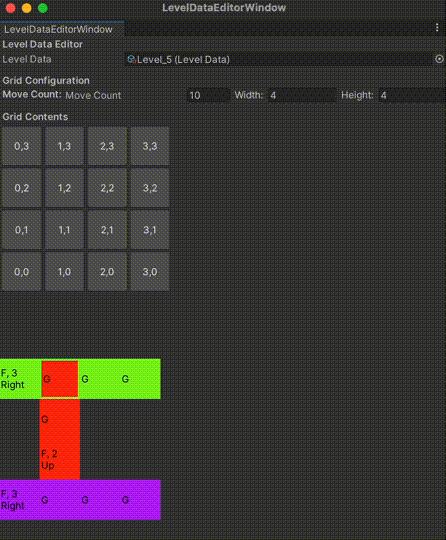

<h1 align="center">Frog game case study </h1>

<h2> Overview </h2>

A puzzle game where players click on frogs in the correct order, guiding them to eat all the necessary food to complete each level.

<h2>Core Gameplay</h2>

Focused on seamless core gameplay with excellent feel, ensuring intuitive controls and a satisfying player experience.

<h2>Custom Level Editor</h2>

Built a custom level editor to allow for easy creation and testing of new levels.

<h2>Design Concepts</h2>
Tried to use these design concepts, including OOP (Polymorphism, Inheritance), S-O-L-I-D principles, various design patterns (Singleton, Observer, MVVM), draw call optimization, coroutines, and event-driven programming to create a scalable game architecture.

